<!-- markdownlint-disable MD033 MD041 -->
<div align="center">

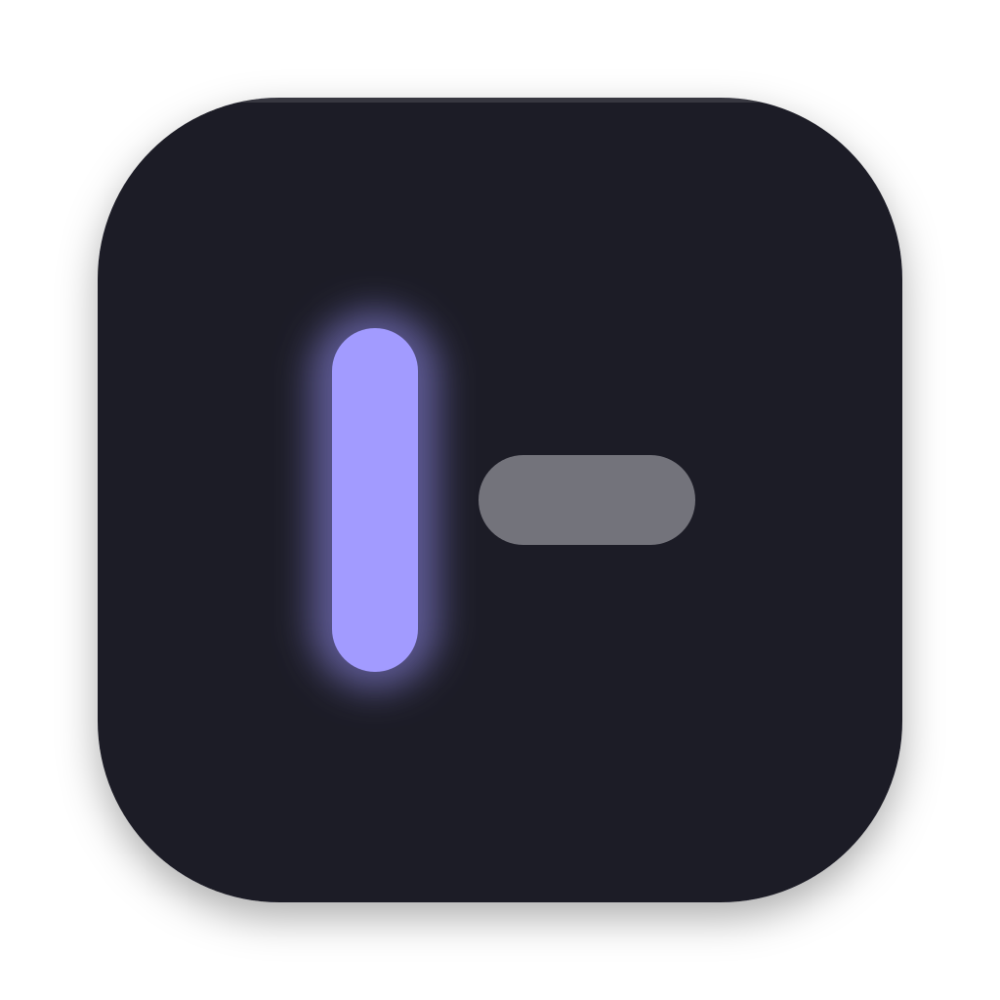

# pal

**A Spotlight replacement for macOS and Linux, with menu bar items of its
own.**<br>
One hotkey, one search over your apps, files, clipboard, windows and 192
palettes. Every palette and every bar item is a TypeScript extension you
can read, change and write.

[](https://github.com/zcag/pal/actions/workflows/ci.yml)
[](LICENSE)


[](https://pal.cagdas.io/extensions)

[Website](https://pal.cagdas.io) ·
[Extension store](https://pal.cagdas.io/extensions) ·
[Getting started](docs/getting-started.md) ·
[Docs](https://pal.cagdas.io/docs) ·
[Write an extension](docs/extensions.md)

<picture>
  <source media="(prefers-color-scheme: dark)"
    srcset="docs/assets/hero-dark.gif">
  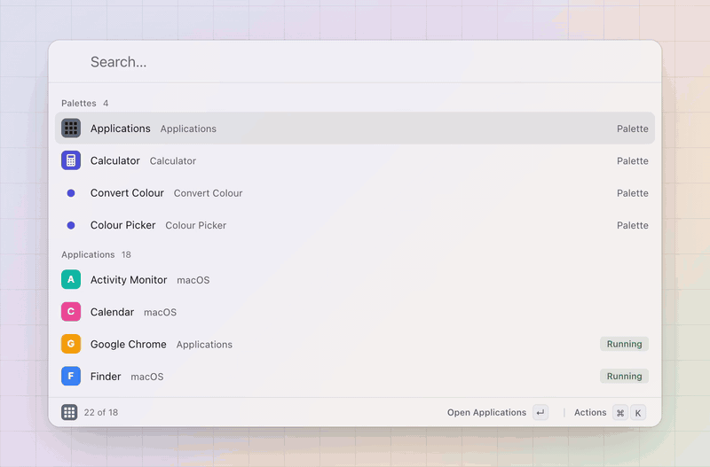
</picture>

<sub>The real panel, rendered by pal's own gallery: <code>chr</code> finds
Chrome, <code>12 usd to try</code> is answered at the root,
<code>#ff8800</code> opens the colour picker.</sub>

</div>

## Why pal

- **One search over everything.** Apps, windows, files, bookmarks,
  clipboard history, emoji and every installed palette answer one query,
  ranked by what you pick. A sum, a currency, a colour, a path or an
  address is answered inline; a query nothing matches falls back to the
  web, a quicklink or a palette.
- **192 palettes in 79 extensions, bundled.** Clipboard History, Files and
  Window Management next to GitHub, Gmail, Slack, Spotify, Calendar, Hue,
  Docker, Obsidian, 1Password, Home Assistant, Immich and a few games.
  Each has its own actions, keys and settings ([Palettes](docs/palettes.md)).
- **Items on your menu bar.** An extension can put a glyph, a title, a
  badge or a progress fill on the bar, and a click opens pal's popover
  with a list, a menu or a live view. The same items work on
  [sketchybar](https://github.com/FelixKratz/SketchyBar) and on Linux bars.
- **Fast.** 1.7 ms from hotkey to a painted panel, and about a
  millisecond to match a keystroke over 17k rows, on a release build
  (measurements in [`notes/decisions.md`](notes/decisions.md)).
- **Yours to change.** Every extension is a directory with a `pal.json`
  and an `index.ts`, the bundled ones included. Settings live in one TOML
  file you can keep in your dotfiles, and every action is a `pal` command
  and a `pal://` link.

## A tour

<table>
  <tr>
    <td width="50%">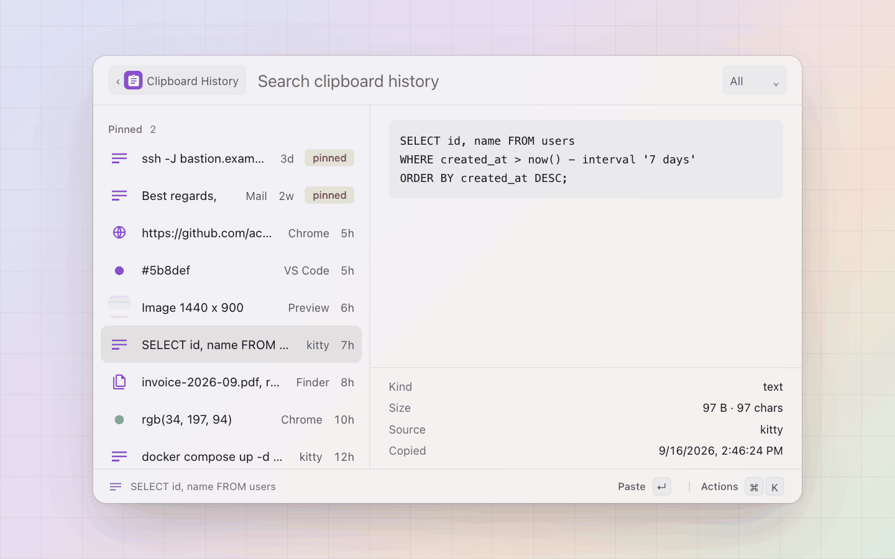</td>
    <td width="50%">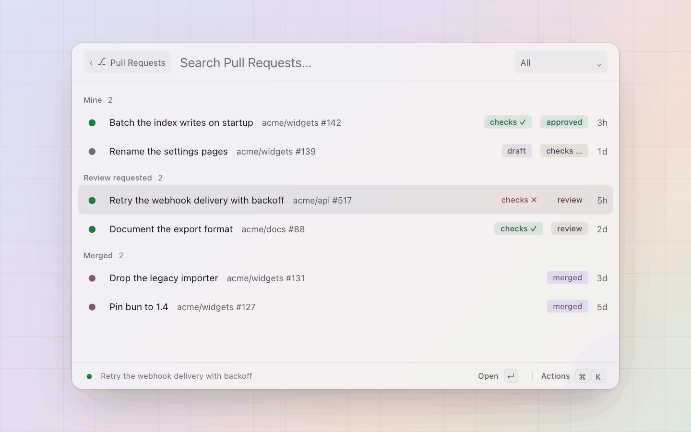</td>
  </tr>
  <tr>
    <td><b>Clipboard history</b>: text, links, colours, images and files,
      searchable, with pins, a preview and the app it came from.</td>
    <td><b>GitHub</b>: your pull requests, reviews, issues and
      notifications, with checks, merge and checkout on keys.</td>
  </tr>
  <tr>
    <td>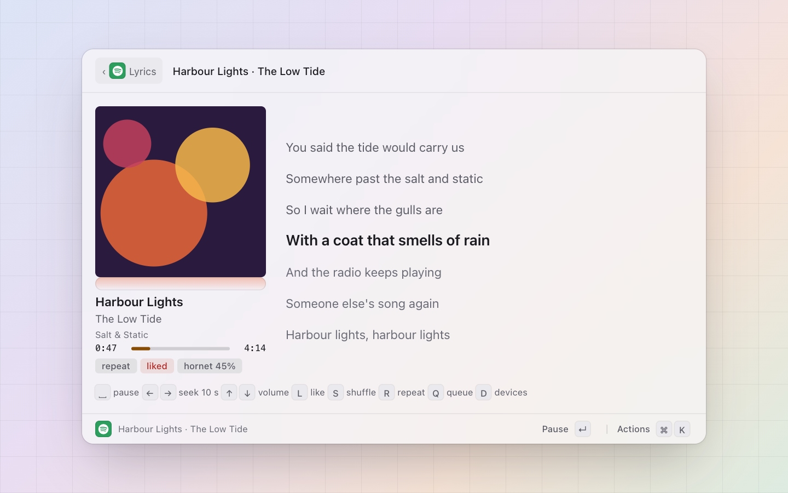</td>
    <td>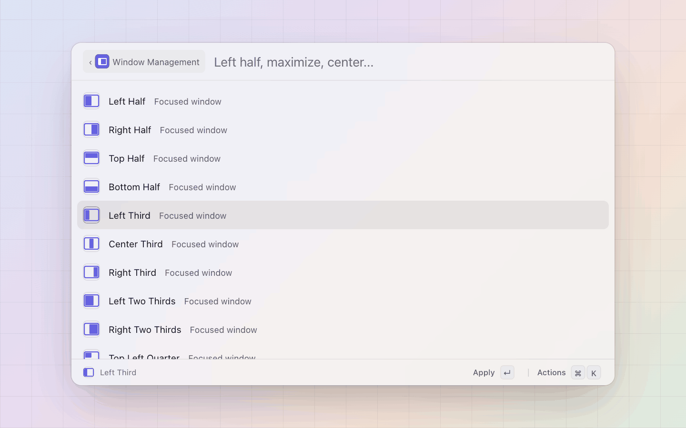</td>
  </tr>
  <tr>
    <td><b>Spotify</b>: search, play, queue and like, and a lyrics view that
      follows the song.</td>
    <td><b>Window management</b>: halves, thirds, layouts and moves between
      displays, from the keyboard.</td>
  </tr>
  <tr>
    <td>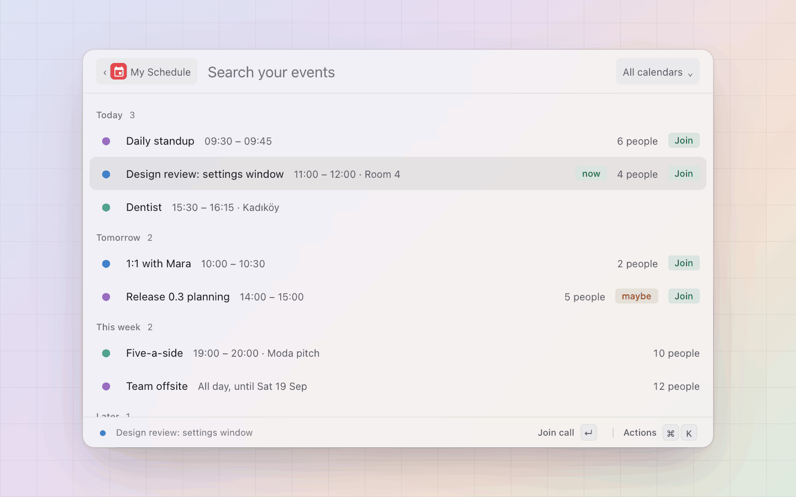</td>
    <td>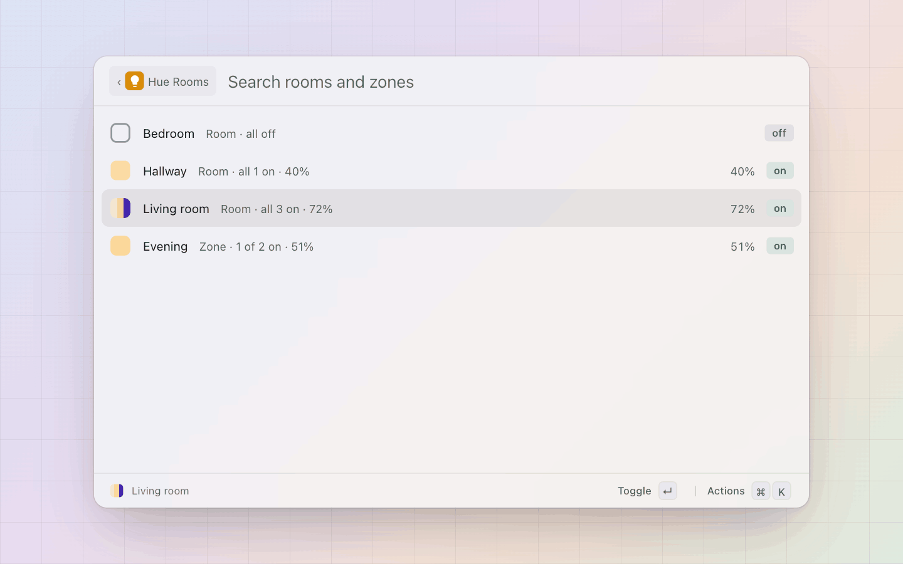</td>
  </tr>
  <tr>
    <td><b>Calendar</b>: your schedule, the next meeting's join link, and new
      events from a sentence.</td>
    <td><b>Philips Hue</b>: rooms, lights, scenes and sensors, over the
      bridge's local API.</td>
  </tr>
  <tr>
    <td>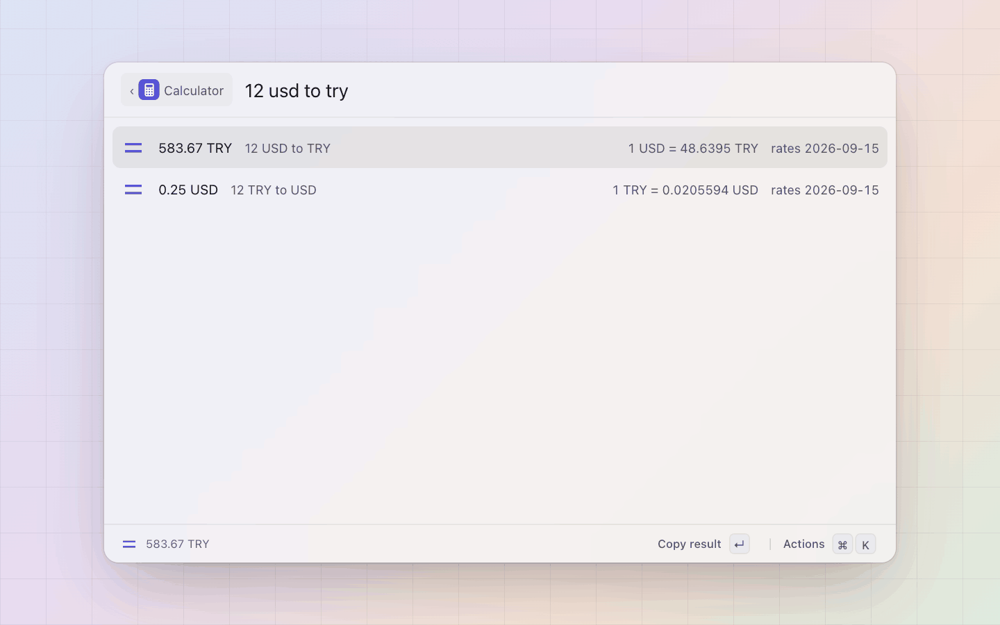</td>
    <td>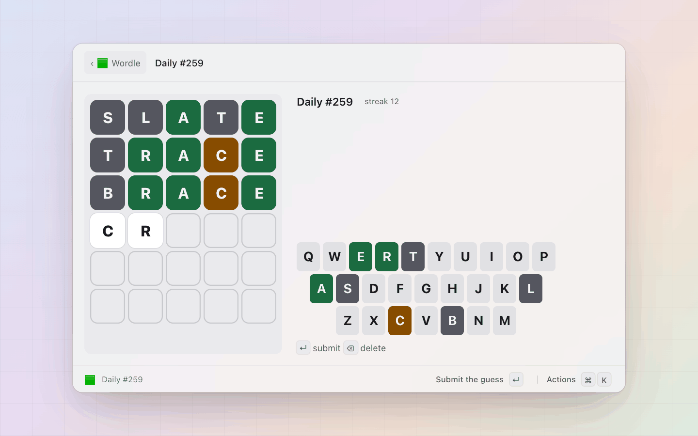</td>
  </tr>
  <tr>
    <td><b>Calculator</b>: sums, units, currencies, dates and time zones,
      answered as you type.</td>
    <td><b>Views</b>: an extension can draw a whole screen of its own, a
      dashboard, a picker or a game.</td>
  </tr>
</table>

Every extension's page in the
[store](https://pal.cagdas.io/extensions) has its screenshots, keys,
settings and source.

## On the menu bar

<table>
  <tr>
    <td width="50%">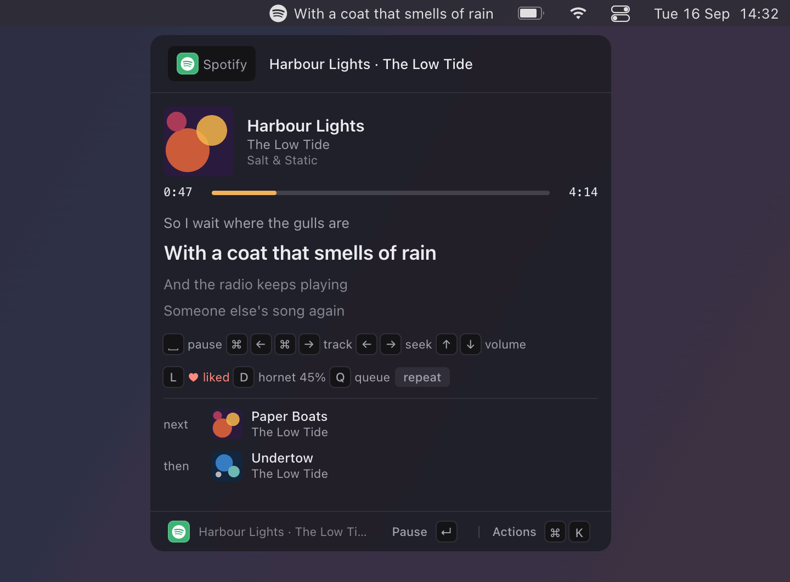</td>
    <td width="50%">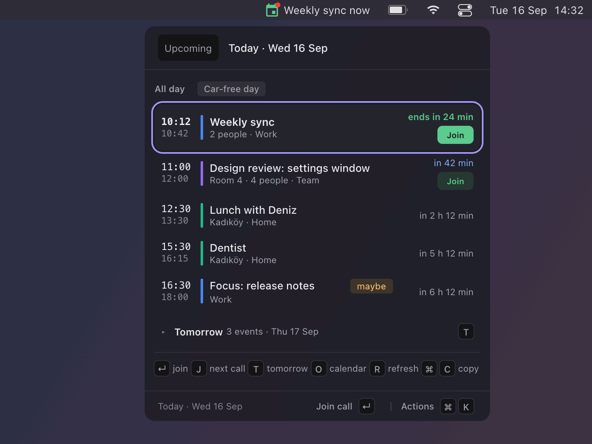</td>
  </tr>
</table>

An extension's `render()` answers what its item shows: a glyph, a short
title, a badge or a progress fill, and nothing at all while there is
nothing to say. A click, a hotkey or a hover opens pal's own popover, and
the same item draws on the macOS menu bar, on sketchybar and on Linux bars.
Twenty-five extensions ship one, from Spotify, calendar, GitHub, Gmail
and Slack to weather, network, battery, system stats, a timer and one-time
codes.

## Built in

Things pal does on its own, each a card in Settings with its switch
([Features](docs/features.md)):

- **Clipboard history**, recorded in the background; apps on an exclude
  list (Keychain Access and Passwords by default) are never recorded.
- **Text expansion**: snippets that expand as you type, in any app.
- **A window switcher** on cmd+tab.
- **A sidebar** at the screen edge.
- **Mouse and trackpad**: three-finger middle click, and scroll direction
  reversed per device.
- **Keycast**: the keys you press and your clicks, drawn on screen for
  recordings and screen shares.

## Write an extension

An extension is a directory with a `pal.json` and an `index.ts`. A palette
answers `list()` with rows and `pick()` with an effect: copy, paste, open,
a toast, a form, a deeper level, a view. pal draws the list, the grid, the
detail pane and the view; the extension never touches a pixel.

```ts
import { defineExtension, type Item } from "@zcag/pal";

export default defineExtension({
  palettes: {
    hello: {
      title: "Hello",
      list: (): Item[] => [
        { id: "greet", name: "Hello, world", icon: "👋",
          actions: [{ id: "copy", title: "Copy" }] },
      ],
      pick: () => ({ copy: "Hello, world" }),
    },
  },
});
```

`pal install .` loads it, and anyone can `pal install github:you/repo`.
The walkthrough is in [Extensions](docs/extensions.md#writing-one), the
smallest complete example in [`examples/hello-extension/`](examples/hello-extension/),
and the API is `@zcag/pal` in [`sdk/`](sdk/). No TypeScript needed for the
simple cases: a shell script or a data file makes a palette too
([Scripts and data files](docs/scripts.md)).

## Configure it in a file

One TOML file holds every setting: the hotkey, each palette's alias and
hotkey, each extension's settings, secrets as references into the keychain.
The Settings window writes the same file, a hand edit is picked up live,
and a theme file recolours every window ([Config](docs/config.md)).

```toml
# ~/.config/pal/config.toml
[general]
hotkey = "ctrl+space"
theme_file = "catppuccin-frappe"
extension_dirs = ["~/dotfiles/pal-extensions"]
```

## Script it

Every action is a `pal` command and a `pal://` link, from a shell, a
keybind, a browser or a Shortcuts action ([CLI](docs/cli.md),
[Links](docs/links.md)):

```sh
pal open emoji/emoji -q smile          # the panel inside a palette
git branch | pal pick                  # pal as a picker for a script
open "pal://timer/start?duration=25m"  # a link from anywhere
```

## Linux too

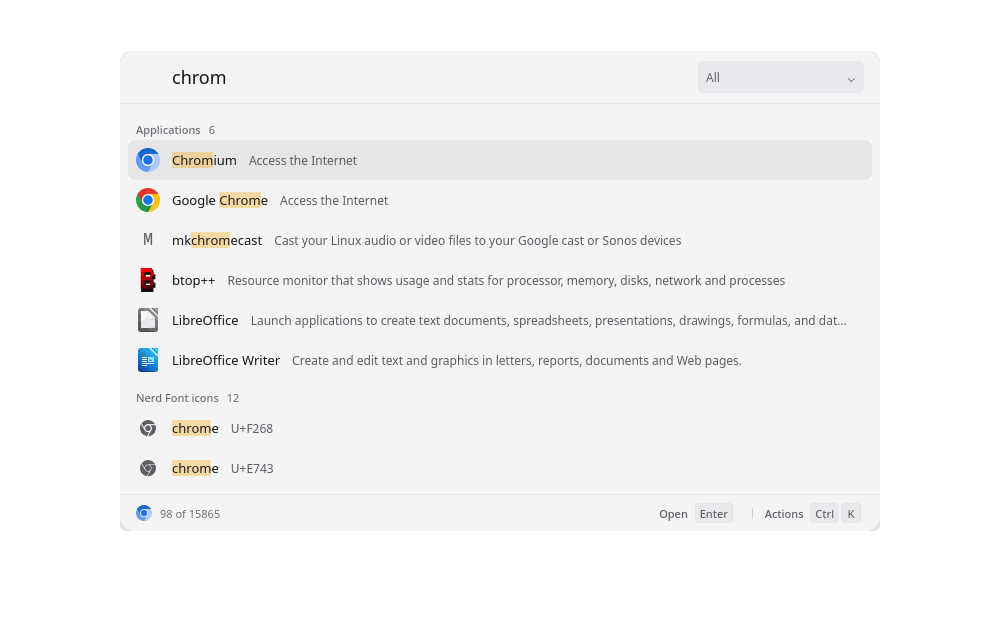

The same panel, palettes and extensions on X11 and Wayland, packaged as an
AppImage, a deb and an rpm. [Getting started](docs/getting-started.md) has
the setup for GNOME, KDE and Hyprland, and the Wayland hotkey caveat.

## Install

Download from [pal.cagdas.io](https://pal.cagdas.io/#download): a dmg
for Apple silicon and Intel Macs, an AppImage and a deb for Linux. What
changed in each release: [the changelog](https://pal.cagdas.io/changelog).
The macOS builds are signed with pal's own certificate, not notarised,
so Gatekeeper refuses the first launch once; [Getting started](docs/getting-started.md#macos) has the
three ways past it.

## Building from source

Prerequisites: Rust (stable), Node 20+, Bun 1.4 or newer (the pinned
release in `app/scripts/fetch-bun.sh`; a 1.3 `bun install` rewrites every
`bun.lock` in the tree, so an older bun leaves the checkout dirty), and the
[Tauri v2 system prerequisites](https://v2.tauri.app/start/prerequisites/)
for your platform (Xcode command line tools and `cmake` on macOS, `brew
install cmake`; webkit2gtk-4.1, gtk3, librsvg, openssl, base-devel on
Linux).

```sh
git clone git@github.com:zcag/pal.git && cd pal
(cd app && npm install)
bun install
for d in extensions/*/; do
  [ -f "$d/package.json" ] && (cd "$d" && bun install)
done
cd app && npm run tauri dev
```

<details>
<summary>What the first build fetches, release builds, and where things
land</summary>

The first cargo build fetches the pinned Bun release into
`app/src-tauri/binaries/pal-bun-<triple>` (`app/scripts/fetch-bun.sh`,
checksum verified, gitignored): it ships inside the app as the extension
host's runtime, and in dev the app runs that same copy. On macOS it also
builds the MediaRemote adapter into `app/src-tauri/mediaremote/`
(`app/scripts/fetch-mediaremote.sh`: a pinned clone and a cmake build,
about ten seconds; `NOTICES.md`), the system-wide Now Playing source the
`media` palette reads. In dev the host and the extensions load from the
repo and reload when a file changes. `bun install` at the root links the
workspace (`host/`, `sdk/`) and the `@zcag/pal` name the extensions
import.

A release build:

```sh
cd app && npm run tauri build
```

`beforeBuildCommand` builds the UI and stages the host, the SDK and the
extensions under `app/src-tauri/resources/` (`app/scripts/build-extensions.sh`:
each extension bundled to one `index.js` with `bun build`, the SDK inlined,
so no `node_modules` ships). The bundle also signs the updater artifacts,
so it wants `TAURI_SIGNING_PRIVATE_KEY` in the environment; without the
key, add `-- --config '{"bundle":{"createUpdaterArtifacts":false}}'`
(releases come from CI anyway: [Releasing](docs/releasing.md)). Output
under `target/release/bundle/`:

- macOS: `macos/pal.app` and `dmg/pal_0.1.0_aarch64.dmg`, ad-hoc signed
  (`bundle.macOS.signingIdentity: "-"`). `make app` builds and installs
  it to `/Applications` signed with `pal-dev`, the certificate releases
  are signed with, so it keeps the grants of the pal it replaces
  ([Releasing](docs/releasing.md#macos-signing)).
- Linux: `appimage/pal_0.1.0_amd64.AppImage`, `deb/pal_0.1.0_amd64.deb` and
  an rpm. The first build downloads `linuxdeploy` and its plugins into
  `~/.cache/tauri/`. On a distro with current binutils (Arch) run it as
  `NO_STRIP=true npm run tauri build`: linuxdeploy's bundled `strip` cannot
  read the libraries and the bundle fails otherwise.

Inside the bundle, `bun` sits next to the `pal` binary (`Contents/MacOS/`,
`usr/bin/`) and the staged tree under the resource directory
(`Contents/Resources/`, `usr/lib/pal/`; on macOS `Resources/mediaremote/`
too). Installed extensions go in the store under the data dir
(`~/Library/Application Support/pal/extensions/`,
`~/.local/share/pal/extensions/`).

</details>

<details>
<summary>The layout of the repo</summary>

- `app/` the Tauri v2 shell: React UI in `src/`, Rust in `src-tauri/`
- `core/` `pal-core`, the parts that are neither UI nor OS glue (config,
  index, clipboard, icons)
- `host/` the extension host, one long-lived Bun process the app talks to
  over stdio
- `sdk/` `@zcag/pal`, the extension API: what an extension imports
- `extensions/` the bundled extensions, one directory each
- `examples/` the smallest complete extension, two script commands, two
  theme files
- `docs/` what [pal.cagdas.io/docs](https://pal.cagdas.io/docs) renders
- `notes/` decisions and platform notes

</details>

## Contributing

Issues and pull requests are welcome at
[github.com/zcag/pal](https://github.com/zcag/pal). `make test` runs what CI
runs on every push (`.github/workflows/ci.yml`, macOS and Ubuntu): `cargo
clippy --workspace --all-targets -- -D warnings`, the Rust workspace's tests,
the SDK's build, `npx tsc --noEmit` and vitest in `app/`, `bunx tsc --noEmit`
(which covers `sdk/`, `extensions/` and `examples/`) and `bun test` in
`host/` ([its rules](host/test/README.md)), and `npm pack --dry-run` in
`sdk/`. Docs are linted with `npx markdownlint-cli2 "docs/**/*.md"
README.md`. An extension of your own does not need a pull request against
the app: publish it on GitHub and anyone can `pal install
github:you/repo`; the store lists community extensions from a
`community.json` at this repo's root (an array of `github:` specs; none
listed yet), which is a one-line pull request.

## Docs

- [Getting started](docs/getting-started.md): install to the first
  extension, in order
- [Config](docs/config.md): the config file key by key
- [Palettes](docs/palettes.md): every bundled palette, its keys and settings
- [Features](docs/features.md): what pal does on its own
- [Scripts and data files](docs/scripts.md): the zero-code tier
- [Keyboard](docs/keyboard.md): the keyboard grammar
- [CLI](docs/cli.md): `pal` and its subcommands
- [Links](docs/links.md): `pal://` links and their `pal` twins
- [Extensions](docs/extensions.md): writing a palette in TypeScript
- [Troubleshooting](docs/troubleshooting.md): the log, permissions, the
  hotkey, PATH, the host
- [Releasing](docs/releasing.md): cutting a release, the updater

## License

MIT, see [LICENSE](LICENSE). What pal ships that is not its own (the
Bun runtime, the Nerd Fonts symbols, the MediaRemote adapter) is listed
with its licence in [NOTICES.md](NOTICES.md).
