<!-- markdownlint-disable MD033 MD041 -->
<div align="center">

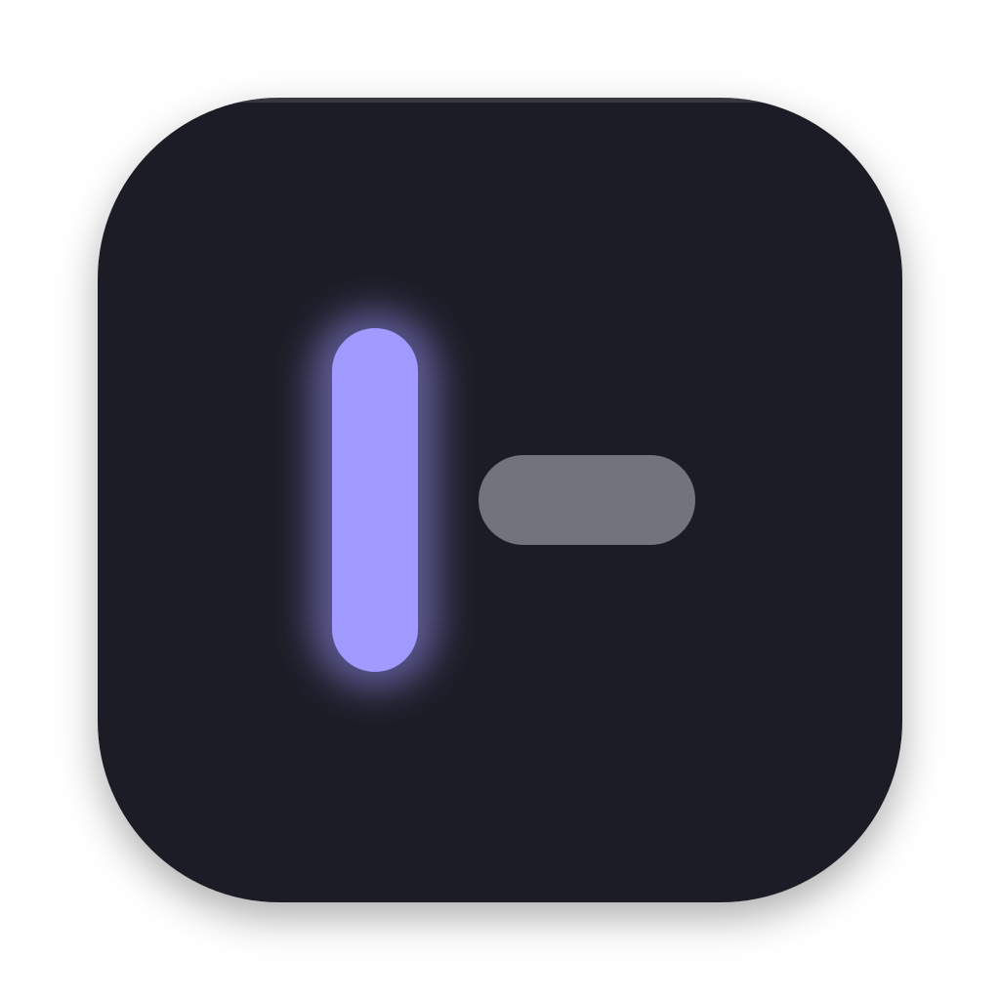

# pal

**A launcher, a menu bar and a place for your small tools, on one
hotkey.**<br>
Apps, files, windows, clipboard and 193 palettes in one search, bar
items that show only what matters, and every piece of it a TypeScript
extension you can read and change. macOS and Linux.

[](https://github.com/zcag/pal/actions/workflows/ci.yml)
[](https://pal.cagdas.io/changelog)
[](LICENSE)


[](https://pal.cagdas.io/extensions)

[**Download**](https://pal.cagdas.io/#download) ·
[Extension store](https://pal.cagdas.io/extensions) ·
[Getting started](docs/getting-started.md) ·
[Docs](https://pal.cagdas.io/docs) ·
[Write an extension](docs/extensions.md) ·
[Changelog](https://pal.cagdas.io/changelog)

<picture>
  <source media="(prefers-color-scheme: dark)"
    srcset="docs/assets/hero-dark.gif">
  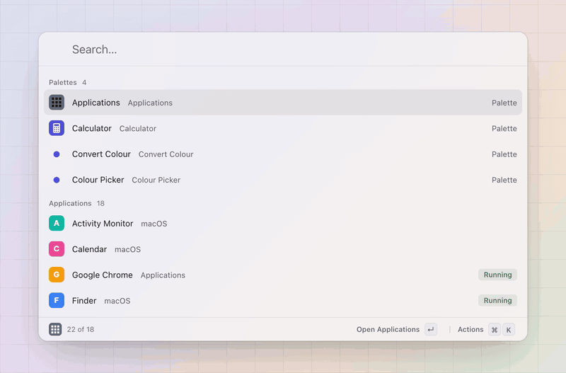
</picture>

<sub>The real panel: <code>chr</code> finds Chrome, <code>12 usd to
try</code> is answered at the root, <code>#ff8800</code> opens the colour
picker.</sub>

</div>

## What it is

Press the hotkey and type. pal searches everything at once and answers
what it can without leaving the search bar:

- **One search.** Apps, windows, files, bookmarks, browser tabs,
  clipboard history, emoji, system commands and every installed palette
  answer one query, ranked by what you pick. Nothing matches? The query
  falls back to the web, a quicklink or a palette.
- **Answers inline.** `3pm in tokyo`, `12 usd to try`, `days until 25
  dec`, `210k / 12`, `#ff8800`, `~/Downloads`: a sum, a currency, a date,
  a colour or a path is answered in the first row.
- **193 palettes in 80 extensions.** 33 come with pal, the ones that need
  no account or setup (Clipboard History, Files, Window Management,
  Audio, Wi-Fi, Media, Timer and more); the rest install in a keystroke
  when you want them: GitHub, Gmail, Slack, Spotify, Calendar, Google
  Search, Hue, Home Assistant, Docker, Obsidian, 1Password, Immich,
  flashcards and a shelf of games. Type a name and an extension you
  don't have yet shows up to install ([Palettes](docs/palettes.md)).
- **Updates on their own.** Extensions update between pal releases,
  signed and checked, and one that breaks is put back by itself. Anyone
  can publish a registry of their own ([registries](docs/registry.md)).
- **A menu bar of its own.** 26 extensions put an item on the bar: the
  lyric playing, the next meeting, who holds your camera, your open PRs.
  An item hides while it has nothing to say, and a click opens a popover
  to act from. The same items draw on the macOS menu bar, on
  [sketchybar](https://github.com/FelixKratz/SketchyBar) and on Linux
  bars.
- **Fast.** 1.7 ms from hotkey to a painted panel on a release build,
  about a millisecond to match a keystroke over 17k rows, and slow
  sources stream in below what is already there instead of holding the
  list back ([`notes/linux.md`](notes/linux.md),
  [`notes/decisions.md`](notes/decisions.md)).
- **Yours.** Every palette and bar item, the bundled ones included, is a
  directory with a `pal.json` and an `index.ts`. Everything is set in
  Settings and mirrored to one TOML file for your dotfiles, and every
  action is a `pal` command and a `pal://` link.

## A tour

<table>
  <tr>
    <td width="50%"><picture>
      <source media="(prefers-color-scheme: dark)"
        srcset="extensions/clipboard/screenshots/1-list-dark.png">
      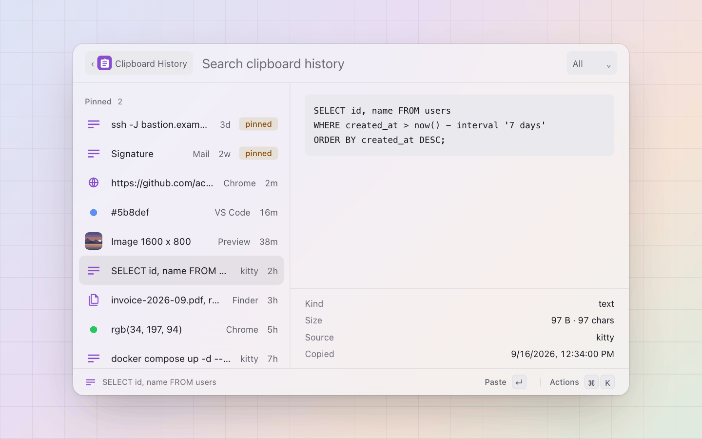
    </picture></td>
    <td width="50%"><picture>
      <source media="(prefers-color-scheme: dark)"
        srcset="extensions/github/screenshots/1-prs-dark.png">
      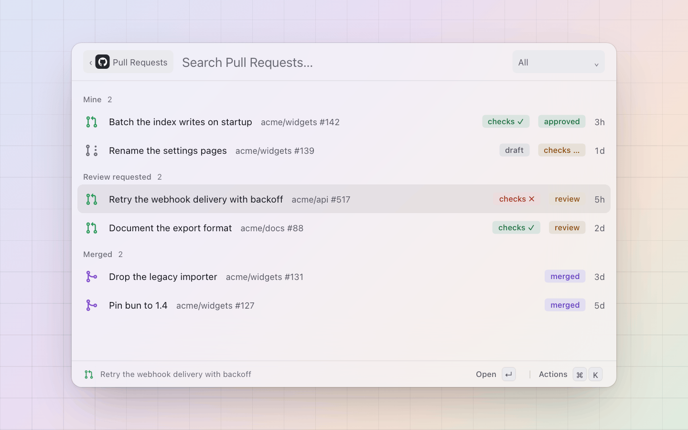
    </picture></td>
  </tr>
  <tr>
    <td><b>Clipboard history</b>: text, links, colours, images and files,
      searchable, with pins, a preview and the app it came from.</td>
    <td><b>GitHub</b>: your pull requests, reviews, issues and
      notifications, with checks, merge and checkout on keys.</td>
  </tr>
  <tr>
    <td><picture>
      <source media="(prefers-color-scheme: dark)"
        srcset="extensions/calc/screenshots/2-dates-dark.png">
      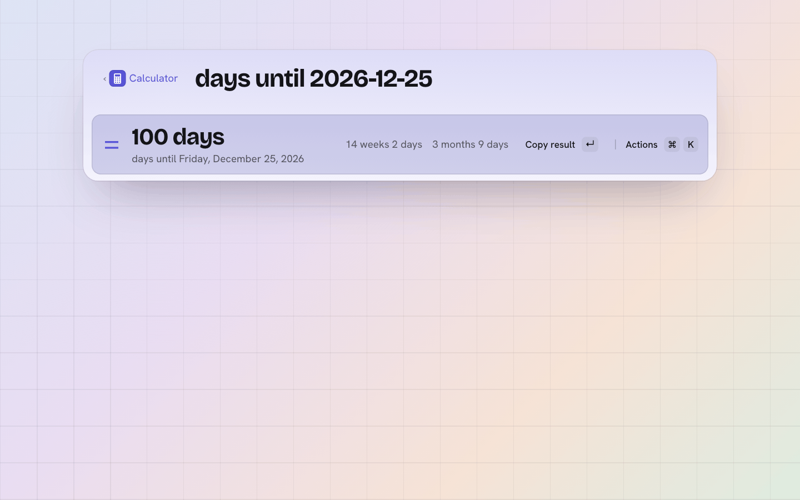
    </picture></td>
    <td><picture>
      <source media="(prefers-color-scheme: dark)"
        srcset="extensions/window-management/screenshots/1-layouts-dark.png">
      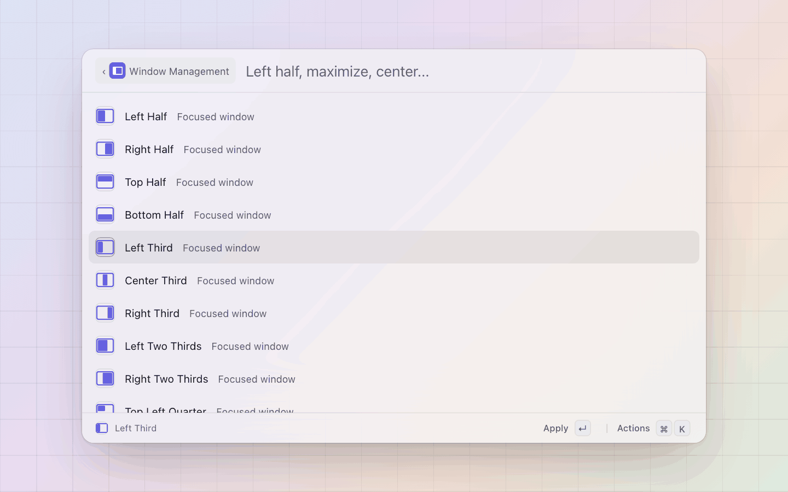
    </picture></td>
  </tr>
  <tr>
    <td><b>Calculator</b>: sums, units, currencies, time zones and dates
      (<code>next friday</code>, <code>workdays until 25 dec</code>), with
      variables of your own.</td>
    <td><b>Window management</b>: halves, thirds, twenty layouts and moves
      between displays, each with a hotkey if you want one.</td>
  </tr>
  <tr>
    <td><picture>
      <source media="(prefers-color-scheme: dark)"
        srcset="extensions/spotify/screenshots/1-lyrics-dark.png">
      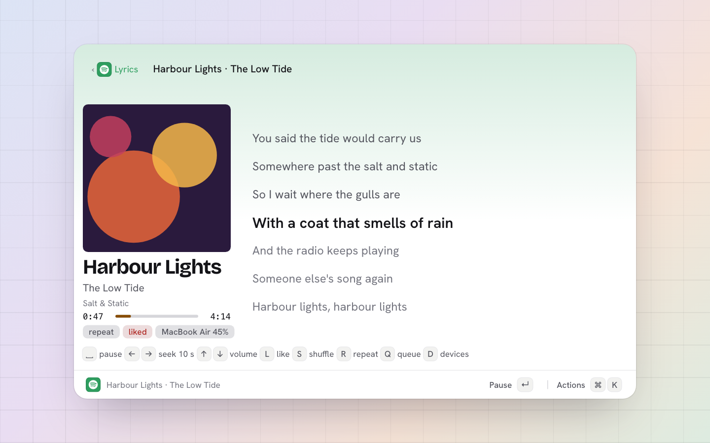
    </picture></td>
    <td><picture>
      <source media="(prefers-color-scheme: dark)"
        srcset="extensions/calendar/screenshots/1-schedule-dark.png">
      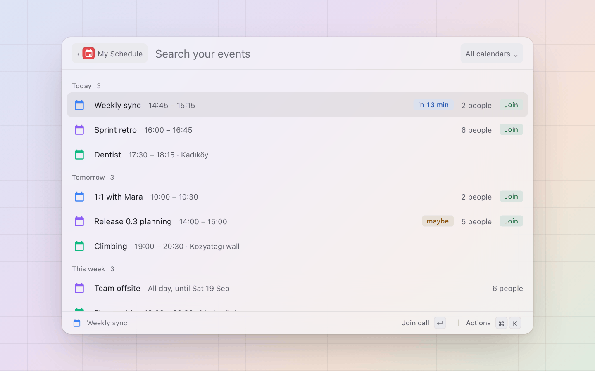
    </picture></td>
  </tr>
  <tr>
    <td><b>Spotify</b>: search, play, queue, like and add to a playlist,
      and a lyrics view that follows the song.</td>
    <td><b>Calendar</b>: your day, new events from a sentence, and a Join
      row at the top of pal five minutes before a call.</td>
  </tr>
  <tr>
    <td><picture>
      <source media="(prefers-color-scheme: dark)"
        srcset="extensions/sessions/screenshots/1-list-dark.png">
      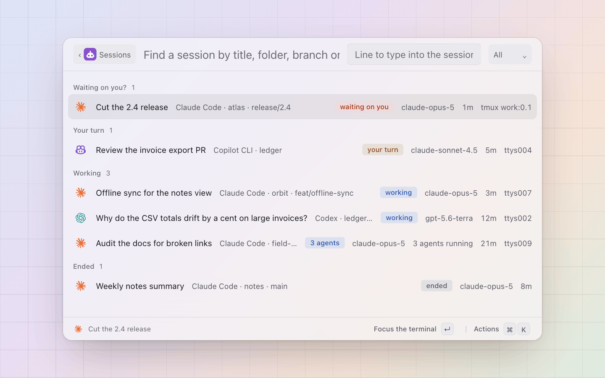
    </picture></td>
    <td><picture>
      <source media="(prefers-color-scheme: dark)"
        srcset="extensions/flashcards/screenshots/1-card-dark.png">
      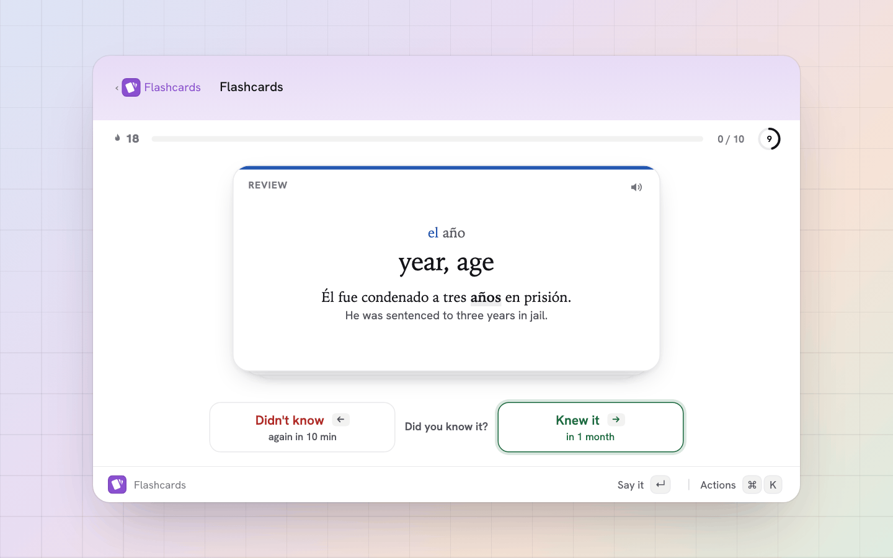
    </picture></td>
  </tr>
  <tr>
    <td><b>Sessions</b>: your Claude Code, Codex and Copilot CLI sessions,
      which one is working and which waits on you, and their
      transcripts.</td>
    <td><b>Flashcards</b>: spaced repetition (FSRS) in ten-card sessions,
      Spanish out of the box, and any Anki deck.</td>
  </tr>
  <tr>
    <td><picture>
      <source media="(prefers-color-scheme: dark)"
        srcset="extensions/power/screenshots/1-now-dark.png">
      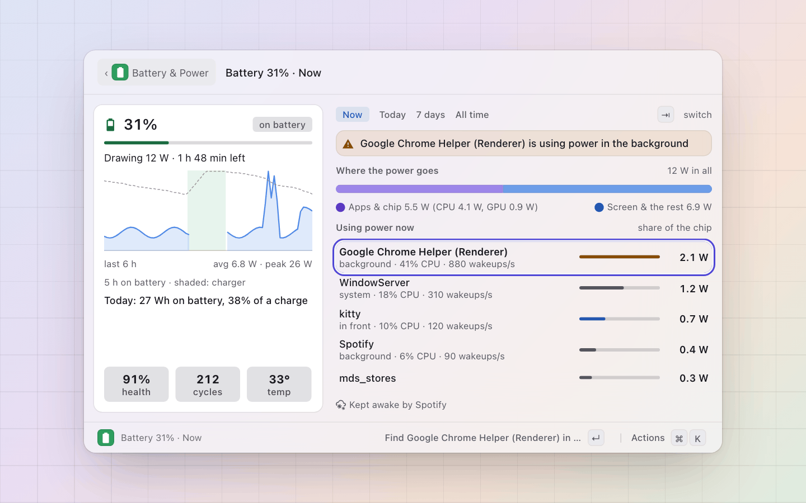
    </picture></td>
    <td><picture>
      <source media="(prefers-color-scheme: dark)"
        srcset="extensions/hue/screenshots/1-rooms-dark.png">
      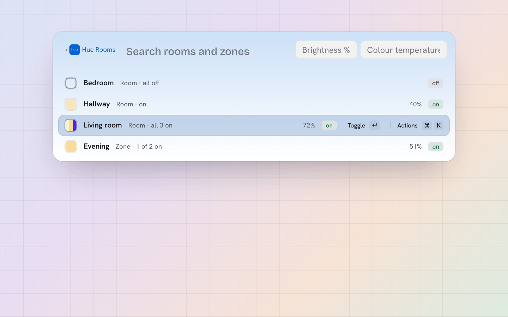
    </picture></td>
  </tr>
  <tr>
    <td><b>Battery &amp; Power</b>: what drains the battery now, today and
      this week, in watts and watt-hours.</td>
    <td><b>Philips Hue</b>: rooms, lights, scenes and sensors, over the
      bridge's local API.</td>
  </tr>
</table>

Each extension's page in the [store](https://pal.cagdas.io/extensions)
has its screenshots, keys, settings and source.

## On the menu bar

<table>
  <tr>
    <td width="50%"><picture>
      <source media="(prefers-color-scheme: dark)"
        srcset="extensions/spotify/screenshots/bar-popover-dark.png">
      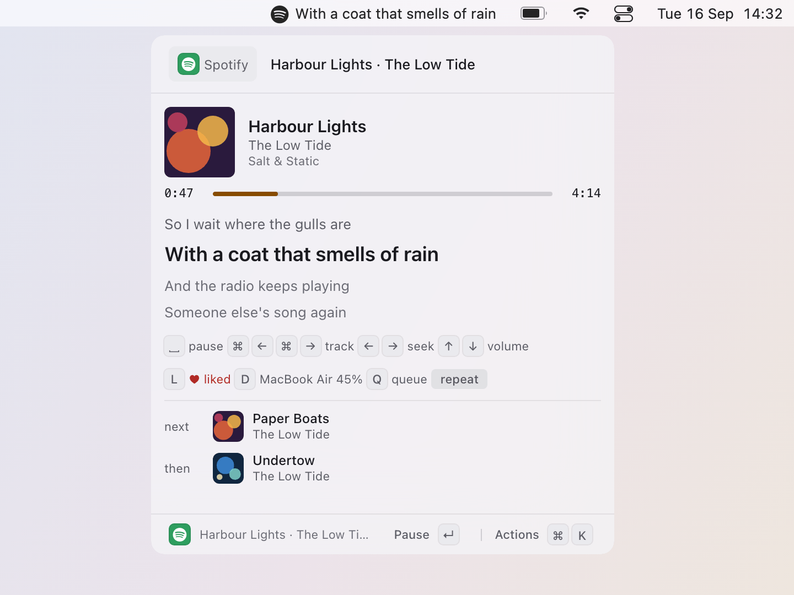
    </picture></td>
    <td width="50%"><picture>
      <source media="(prefers-color-scheme: dark)"
        srcset="extensions/calendar/screenshots/bar-popover-dark.png">
      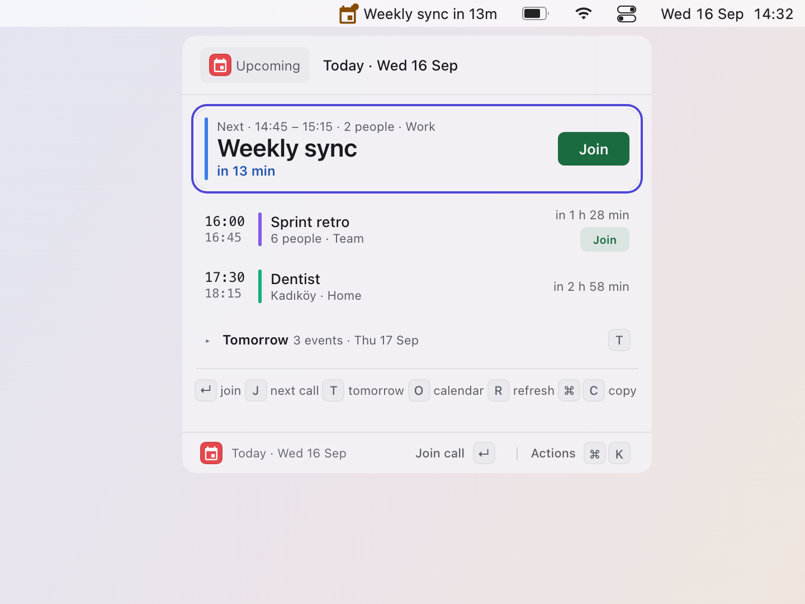
    </picture></td>
  </tr>
  <tr>
    <td><picture>
      <source media="(prefers-color-scheme: dark)"
        srcset="extensions/privacy/screenshots/bar-popover-dark.png">
      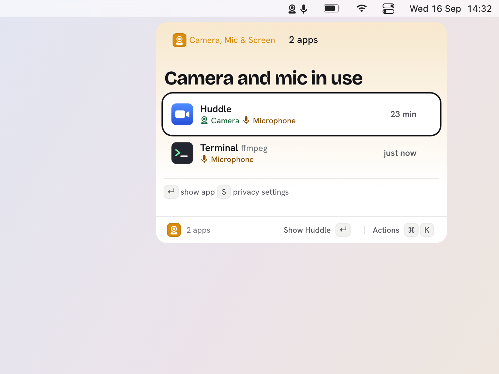
    </picture></td>
    <td><picture>
      <source media="(prefers-color-scheme: dark)"
        srcset="extensions/stats/screenshots/bar-popover-dark.png">
      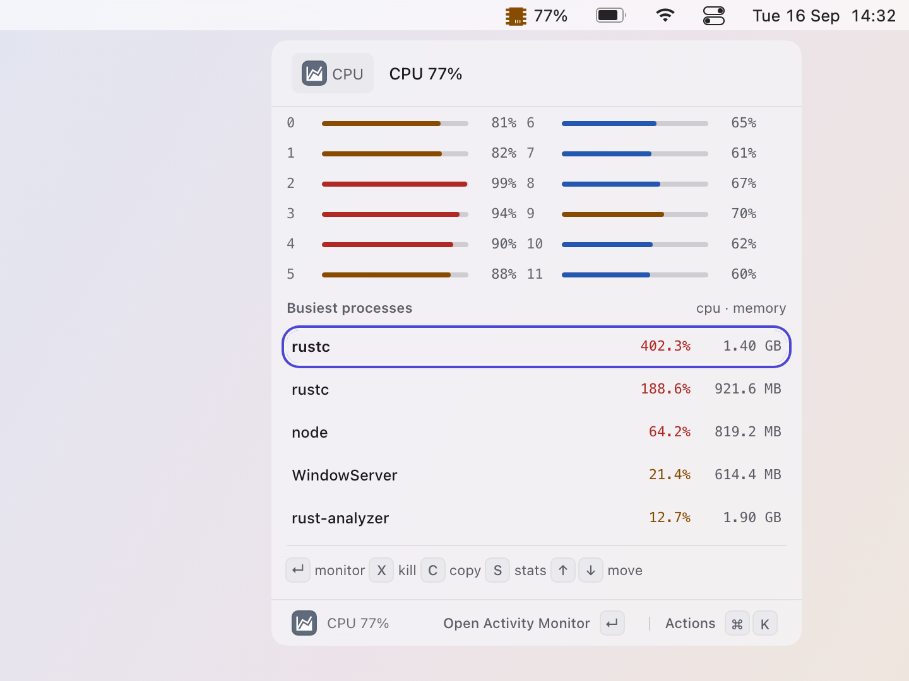
    </picture></td>
  </tr>
</table>

An extension's `render()` says what its item shows: a glyph, a short
title, a badge or a progress fill, or nothing while there is nothing to
say. Privacy appears only while an app has your camera, microphone or
screen; Calendar turns amber before a meeting; Audio flashes the volume
for three seconds after you change it. A click, a hotkey or a hover opens
the popover. Items can also show or hide on **states** (the time, the
front app, the network, idle, or your own), with rules set per item in
Settings › Bar ([Extensions](docs/extensions.md#bar-items-glanceable-state-on-the-bar)).

The 26 that ship: Spotify, Now Playing, Calendar, GitHub, Gmail, Slack,
WhatsApp, Sessions, Privacy, Battery &amp; Power, Stats, Network, Wi-Fi,
Bluetooth, Audio, Displays, Weather, Timer, One-time codes, Hue, Docker,
Grafana, Odak, Theater, Tela and States.

## Games, too

Sudoku (made on your machine, graded by technique, three-step hints),
daily Crosswords from Crosshare and the Turkish papers, Solitaire,
Minesweeper, Snake II (the Nokia 3310's, frame for frame), Yahtzee,
Wordle, 2048, Blackjack and a monkeytype-style Typing test. Each plays
one-handed on the arrows and Enter, and `⌘⇧F` plays it at 90% of the
screen.

<table>
  <tr>
    <td width="33%"><picture>
      <source media="(prefers-color-scheme: dark)"
        srcset="extensions/sudoku/screenshots/1-solving-dark.png">
      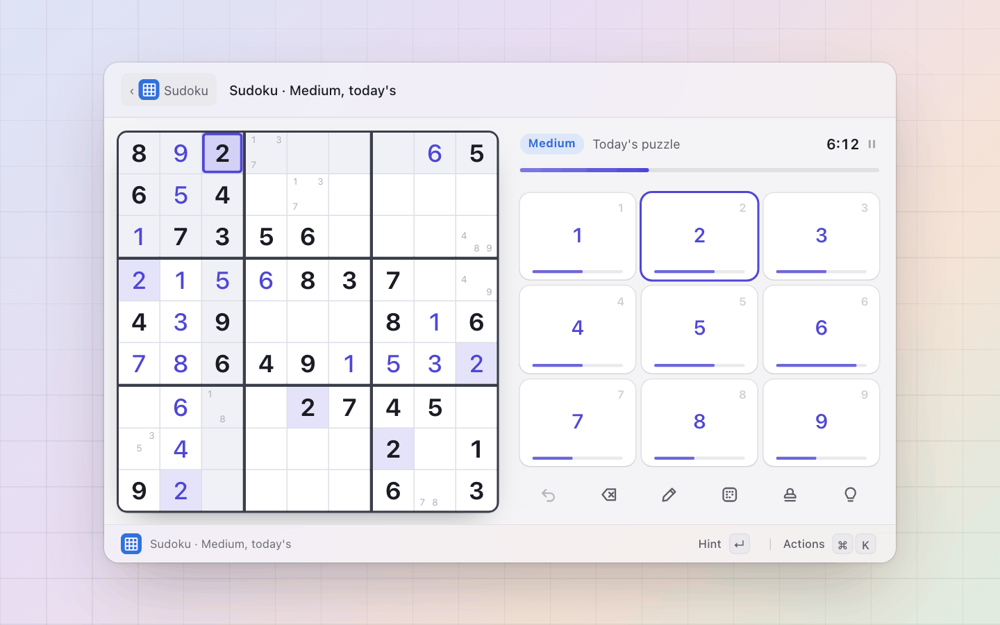
    </picture></td>
    <td width="33%"><picture>
      <source media="(prefers-color-scheme: dark)"
        srcset="extensions/crossword/screenshots/1-solving-dark.png">
      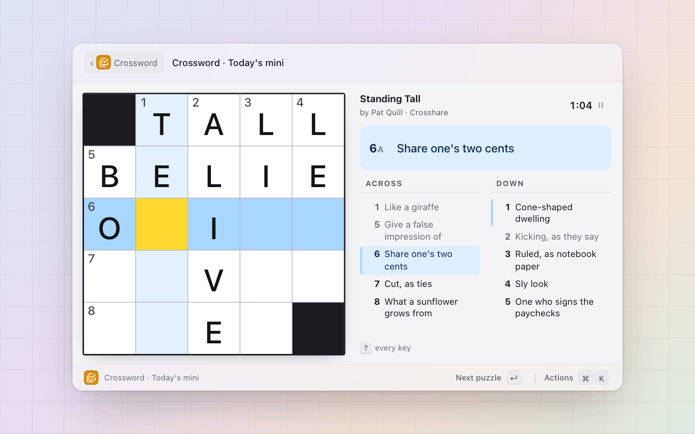
    </picture></td>
    <td width="33%"><picture>
      <source media="(prefers-color-scheme: dark)"
        srcset="extensions/snake/screenshots/1-play-dark.png">
      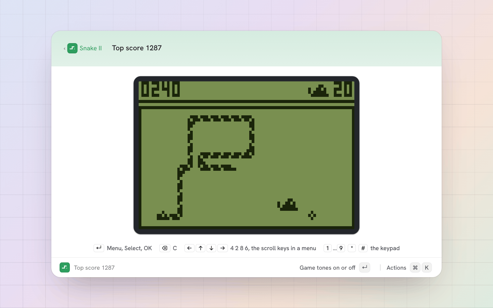
    </picture></td>
  </tr>
</table>

## Built in

Things pal does on its own, each a card in Settings › Features with its
switch and settings ([Features](docs/features.md)):

- **Clipboard history**, recorded in the background into a local SQLite
  database; apps on an exclude list (Keychain Access and Passwords by
  default) are never recorded.
- **Text expansion**: snippets that expand as you type, in any app.
- **A window switcher** on a held chord (`alt+tab`, or `cmd+tab` in place
  of macOS's own).
- **A sidebar**: a live palette docked to a screen edge.
- **Keep below the bar**: windows are moved clear of a sketchybar strip
  over a hidden menu bar.
- **Mouse and trackpad**: three-finger middle click, scroll direction per
  device, and the pointer hidden while idle.
- **Keycast**: your keys and clicks drawn on screen, for recordings and
  screen shares.

## Getting around

Enter runs a row, `⌘K` opens its actions, `⌘I` its detail pane, and any
action's shortcut runs it straight from the list. Rows that take values
ask for them in the search bar (a timer's duration, an ssh command, a
Slack status: Tab moves into the fields). `⌘`-click, `⇧`-click or
`⇧↓` marks several rows, and the actions that make sense for a list run
on all of them: open, copy, move, star, snooze. The whole grammar is in
[Keyboard](docs/keyboard.md).

## Write an extension

An extension is a directory with a `pal.json` and an `index.ts`. A palette
answers `list()` with rows and `pick()` with an effect: copy, paste, open,
a toast, a form, a deeper level, a view. pal draws the list, the grid, the
detail pane and the view; the extension never touches a pixel.

```ts
import { defineExtension, type Item } from "@zcag/pal";

export default defineExtension({
  palettes: {
    hello: {
      title: "Hello",
      list: (): Item[] => [
        { id: "greet", name: "Hello, world", icon: "👋",
          actions: [{ id: "copy", title: "Copy" }] },
      ],
      pick: () => ({ copy: "Hello, world" }),
    },
  },
});
```

`pal install .` loads it, and anyone can `pal install github:you/repo`.
From there the same API grows into:

- **Views**: a render tree for dashboards, detail pages and pickers
  ([View palettes](docs/extensions.md#view-palettes-a-render-tree)).
- **Surfaces**: a sandboxed page of your own, for a game or anything a
  view cannot draw ([Game surfaces](docs/extensions.md#game-surfaces-a-page-of-your-own)).
- **Bar items**, **forms**, **typed arguments**, **links** of your own,
  and **several accounts** of one extension (a personal and a work
  Gmail).
- **Streaming**: `ctx.partial(items)` shows what is ready while a slow
  listing is still working
  ([Slow listings](docs/extensions.md#slow-listings-show-what-is-ready)).

The walkthrough is in [Extensions](docs/extensions.md#writing-one), the
smallest complete examples in [`examples/`](examples/) (a palette, a
surface, script commands, themes), and the API is `@zcag/pal` in
[`sdk/`](sdk/). No TypeScript needed for the simple cases: a shell script
or a data file makes a palette too ([Scripts and data files](docs/scripts.md)).

## Configure it in a file

One TOML file holds every setting: the hotkey, each palette's alias and
hotkey, each extension's settings, and secrets as references into the
keychain. The Settings window writes the same file, a hand edit is picked
up live, and a theme file recolours every window ([Config](docs/config.md)).

```toml
# ~/.config/pal/config.toml
[general]
hotkey = "ctrl+space"
theme_file = "catppuccin-frappe"
extension_dirs = ["~/dotfiles/pal-extensions"]

[palettes.emoji]
alias = "em"
```

## Script it

Every action is a `pal` command and a `pal://` link, from a shell, a
keybind, a browser or a Shortcuts action ([CLI](docs/cli.md),
[Links](docs/links.md)):

```sh
pal open emoji/emoji -q smile          # the panel inside a palette
git branch | pal pick                  # pal as a picker for a script
open "pal://timer/start?duration=25m"  # a link from anywhere
```

## Install

Download from [pal.cagdas.io](https://pal.cagdas.io/#download): a dmg for
Apple silicon and Intel Macs, an AppImage and a deb for Linux. pal
updates itself from there on.

The macOS builds are signed with pal's own certificate, not notarised,
so Gatekeeper refuses the first launch once;
[Getting started](docs/getting-started.md#macos) has the three ways past
it. Permissions (Accessibility, Input Monitoring and the rest) are asked
for when a feature needs them, never at launch, and survive updates.

### Linux

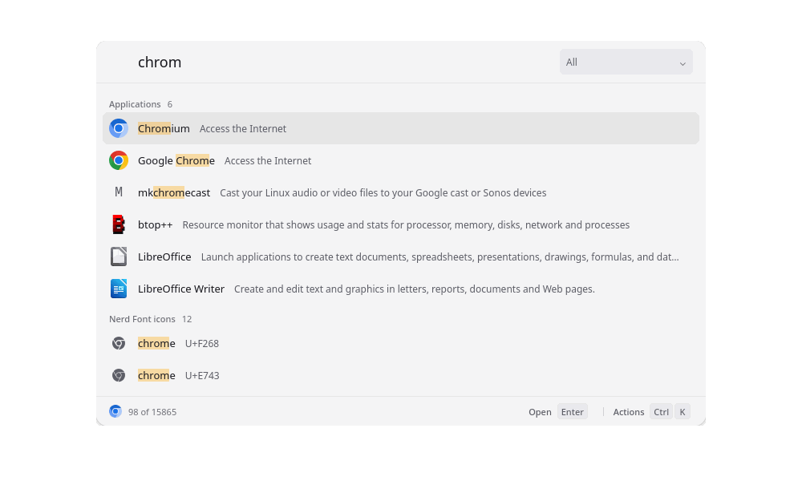

The same panel, palettes and extensions on X11 and Wayland.
[Getting started](docs/getting-started.md#linux) has the setup for GNOME,
KDE and Hyprland, and the Wayland hotkey caveat.

## Building from source

Prerequisites: Rust (stable), Node 20+, Bun 1.4 or newer (the pinned
release in `app/scripts/fetch-bun.sh`; a 1.3 `bun install` rewrites every
`bun.lock` in the tree), and the
[Tauri v2 system prerequisites](https://v2.tauri.app/start/prerequisites/)
for your platform (Xcode command line tools and `cmake` on macOS;
webkit2gtk-4.1, gtk3, librsvg, openssl and base-devel on Linux).

```sh
git clone git@github.com:zcag/pal.git && cd pal
(cd app && npm install)
bun install
for d in extensions/*/; do
  [ -f "$d/package.json" ] && (cd "$d" && bun install)
done
cd app && npm run tauri dev
```

In dev the host and the extensions load from the repo and reload when a
file changes. On macOS, `make app` builds a release and installs it to
`/Applications`, signed with the same certificate as releases so it keeps
their permissions.

<details>
<summary>What the first build fetches, release builds, and where things
land</summary>

The first cargo build fetches the pinned Bun release into
`app/src-tauri/binaries/pal-bun-<triple>` (`app/scripts/fetch-bun.sh`,
checksum verified, gitignored): it ships inside the app as the extension
host's runtime, and in dev the app runs that same copy. On macOS it also
builds the MediaRemote adapter into `app/src-tauri/mediaremote/`
(`app/scripts/fetch-mediaremote.sh`: a pinned clone and a cmake build,
about ten seconds; `NOTICES.md`), the system-wide Now Playing source the
`media` palette reads. `bun install` at the root links the workspace
(`host/`, `sdk/`) and the `@zcag/pal` name the extensions import.

A release build:

```sh
cd app && npm run tauri build
```

`beforeBuildCommand` builds the UI and stages the host, the SDK and the
extensions under `app/src-tauri/resources/` (`app/scripts/build-extensions.sh`:
each extension bundled to one `index.js` with `bun build`, the SDK inlined,
so no `node_modules` ships). The bundle also signs the updater artifacts,
so it wants `TAURI_SIGNING_PRIVATE_KEY` in the environment; without the
key, add `-- --config '{"bundle":{"createUpdaterArtifacts":false}}'`
(releases come from CI anyway: [Releasing](docs/releasing.md)). Output
lands under `target/release/bundle/`:

- macOS: `macos/pal.app` and a dmg, ad-hoc signed. `make app` signs with
  `pal-dev` instead ([Releasing](docs/releasing.md#macos-signing)).
- Linux: an AppImage, a deb and an rpm. The first build downloads
  `linuxdeploy` into `~/.cache/tauri/`. On a distro with current binutils
  (Arch) run it as `NO_STRIP=true npm run tauri build`: linuxdeploy's
  bundled `strip` cannot read the libraries otherwise.

Inside the bundle, `bun` sits next to the `pal` binary (`Contents/MacOS/`,
`usr/bin/`) and the staged tree under the resource directory
(`Contents/Resources/`, `usr/lib/pal/`). Installed extensions go under the
data dir (`~/Library/Application Support/pal/extensions/`,
`~/.local/share/pal/extensions/`).

</details>

<details>
<summary>The layout of the repo</summary>

- `app/` the Tauri v2 shell: React UI in `src/`, Rust in `src-tauri/`
- `core/` `pal-core`, the parts that are neither UI nor OS glue (config,
  index, clipboard, icons)
- `host/` the extension host, one long-lived Bun process the app talks to
  over stdio
- `sdk/` `@zcag/pal`, the extension API: what an extension imports
- `extensions/` the bundled extensions, one directory each
- `examples/` the smallest complete palette and surface, two script
  commands, two theme files
- `docs/` what [pal.cagdas.io/docs](https://pal.cagdas.io/docs) renders
- `notes/` decisions, measurements and platform notes

</details>

## Contributing

Issues and pull requests are welcome at
[github.com/zcag/pal](https://github.com/zcag/pal). `make test` runs what
CI runs on every push, on macOS and Ubuntu: clippy with warnings as
errors, the Rust tests, the SDK build, the app's typecheck and vitest,
the host's typecheck (which covers `sdk/`, `extensions/` and `examples/`)
and `bun test` ([its rules](host/test/README.md)), and the SDK's pack.
Docs are linted with `npx markdownlint-cli2 "docs/**/*.md" README.md`.

An extension of your own needs no pull request against the app: publish
it on GitHub and anyone can `pal install github:you/repo`. To list it in
the store, open a pull request adding its `github:` spec to
`community.json` at this repo's root.

## Docs

| | |
| --- | --- |
| [Getting started](docs/getting-started.md) | install to the first extension, in order |
| [Config](docs/config.md) | the config file key by key |
| [Palettes](docs/palettes.md) | every bundled palette, its keys and settings |
| [Features](docs/features.md) | what pal does on its own |
| [Keyboard](docs/keyboard.md) | the keyboard grammar |
| [Scripts and data files](docs/scripts.md) | the zero-code tier |
| [CLI](docs/cli.md) | `pal` and its subcommands |
| [Links](docs/links.md) | `pal://` links and their `pal` twins |
| [Extensions](docs/extensions.md) | writing a palette, a view, a surface or a bar item |
| [Troubleshooting](docs/troubleshooting.md) | the log, permissions, the hotkey, PATH, the host |
| [Releasing](docs/releasing.md) | cutting a release, the updater |
| [Changelog](docs/changelog.md) | what changed in each release |

## License

MIT, see [LICENSE](LICENSE). What pal ships that is not its own (the Bun
runtime, the Nerd Fonts symbols, the MediaRemote adapter) is listed with
its licence in [NOTICES.md](NOTICES.md).
